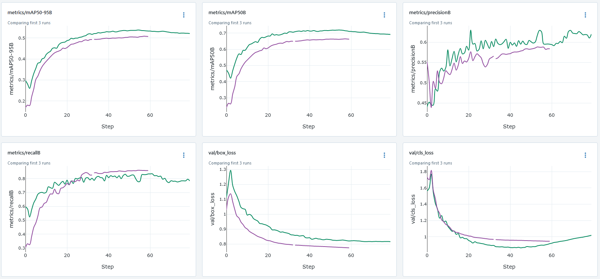
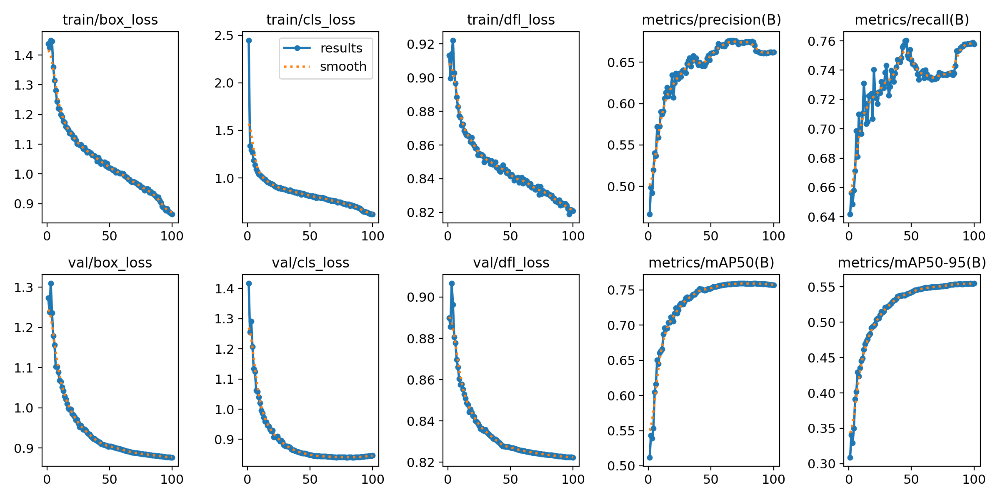
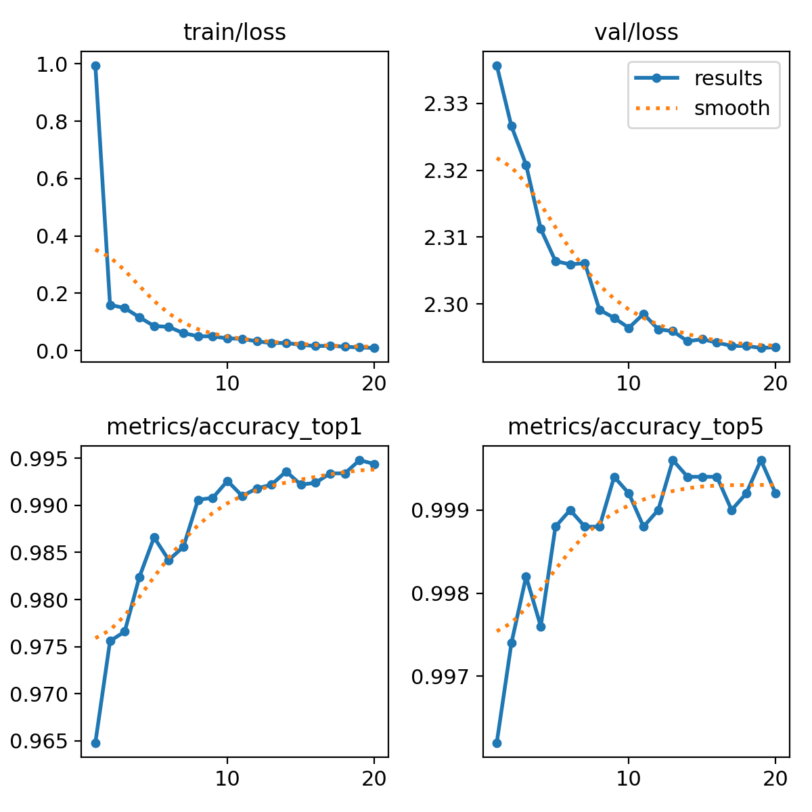
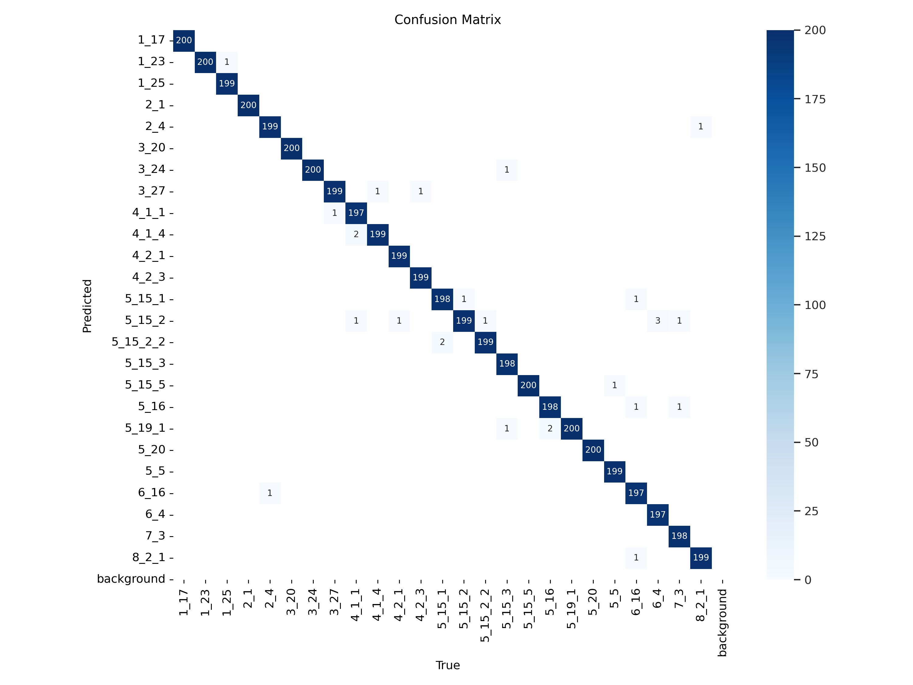

# Проект "Распознавание дорожных знаков"

Наш проект посвящён распознаванию и классификации дорожных знаков.

## Постановка бизнес-задачи

**Кому и как это может пригодиться?**

- водителю как расширение функциональности автомобиля: подаётся видео с камеры заднего/переднего вида или видеорегистратора; на выходе голосовая информация об обнаружении дорожных знаков и рекомендации по принятию решений (ADAS, Advanced Driver Assistance Systems);
- расширение функциональности навигаторов и карт: наше решение нужно для ускорения работы картографов, которые наносят на карты информацию о дорожных знаках. На вход подаются кадры, заснятые видеорегистратором, нужно на них детектировать и классифицировать знаки;
- в системах мониторинга знаков на дорогах для служб дорожного хозяйства;
- в совокупности со множеством других технологий (датчики, сенсоры и тп) обученная модель может быть использована в беспилотных автомобилях или автомобилях с режимом автопилот.

## ML-решение

### Общий пайплайн

Мы рассматривали 2 возможных варианта пайплайна обработки:

1. Входной кадр → Детектор (многоклассовый на все типы дорожных знаков) → Найденные знаки с координатами bbox-а и меткой

2. Входной кадр → Детектор (только 1 класс: road sign) → Кропы с дорожными знаками → Классификатор → Найденные знаки с координатами bbox-а и меткой

Идея реализации второго варианта пайплайна состоит в том, чтобы перенести борьбу с проблемой несбалансированностью классов на этап классификатора, на уровне которого её легче решать.

В рамках наших экспериментов по обучению моделей были опробованы оба варианта пайплайна.

### Используемый датасет

Для обучения, валидации и тестирования моделей мы использовали датасет с российскими дорожными знаками RTSD:

- [kaggle](https://www.kaggle.com/datasets/watchman/rtsd-dataset),
- [статья](https://computeroptics.ru/eng/KO/PDF/KO41-ENG%20-17/400221.pdf).

После проведённого нами анализа данного датасета ([eda](https://github.com/DL-teammm/road_signs_recognition/blob/main/notebooks/eda.ipynb)) были выявлены следующие проблемы:

- есть много редких классов,
- наблюдается несбалансированность между разными классами.

Поэтому были созданы несколько версий датасетов для проведения экспериментов. В первой версии оставлены только те классы, где количество меток больше или равно 500. После чего на каждый такой класс случайным образом выбирается 500 изображений, содержащих хотя бы одну метку. Итого имеется 36 сбалансированных классов и 16596 изображений. Во второй же версии датасета дизбаланс классов игнорируется и переносится на архитектуру модели: выбраны максимум 1000 экземпляров каждого класса. Здесь же получается 22383 изображений и 146 классов.

Модифицированный датасет был выложен на kaggle: [our_dataset](https://www.kaggle.com/datasets/4991145816988d062fe6bb2db9298c816cd9f63f60d325635ecb82da77c9e760).

### Экcперименты по обучению моделей

1. **Первый вариант пайплайна:** была обучена детекционная модель yolov8m на всех классах дорожных знаков. Графики результатов обучения из MLflow приведены ниже. Зеленый - первая версия датасета с сбалансированными данными, но меньшим числом классов. Фиолетовый - вторая версия со всеми классами. Как можно видеть из графиков вторая версия незначительно проигрывает по метрикам, но дает гораздо больший охват типов знаков. Разрыв на графиках означает приостановку и возобновление обучения. Скорость инференса данной модели составляет 11.5ms на Kaggle GPU T4


      Также был проведён эксперимент по обучению детекционной модели RT-DETR: в папке ```notebooks``` есть ноутбук с запуском обучения, также информация о запуске сохранена в MLflow. В рамках этого эксперимента модель обучалась гораздо медленнее, чем yolov8, метрики качества на валидации на соответствующих эпохах не превышали метрики для обученной ранее yolov8m-модели; скорость инференса RT-DETR также была бы медленнее, чем у yolov8. Поэтому было решено не добавлять данную модель в итоговое решение.

2. **Второй вариант пайплайна:** были отдельно обучены детекционная модель yolov8 с одним классом road_sign и классификационная модель yolov8.
    
    2.1. **Детекция:** для детектирования дорожных знаков одним классом была обучена легковесная модель YOLOv8 nano, т.к. в комплексном решении необходимо добиться высокой скорости работы программы. Ввиду того, что все дорожные знаки для данной модели должны быть одним классом, то в датасете все классы были объединены в один, в то время как остальные параметры остались неизменны. Данное решение позволяет интегрировать модель не только в приложения с постобработкой, но и решения, работающие в реальном времени.

    <div class="row" style="display: flex;">
      <div class="column" style="display: flex; padding: 5px;">
            
      </div>
    </div>
    
    2.2. **Классификация:** для обучения использовался модифицированный датасет, состоящий из 20тыс. тренировочных изображений и 5тыс. валидационных. Были обучены три версии модели yolov8 (small, medium, large) и resnet18 в течение 20 эпох.

    Таблица `Оценка работы моделей`

|    модель   |       датасет      | число параметров | время инференса  |           целевая метрика            |
|-------------|--------------------|------------------|------------------|--------------------------------------|
| YOLOv8s-cls | RTSD Dataset (2GB) |     5 112 761    | 0.5ms inference  |          top1 = 0.995 top5 = 1       |
| YOLOv8m-cls | RTSD Dataset (2GB) |    15 804 361    | 0.9ms inference  |          top1 = 0.994 top5 = 0.999   |
| YOLOv8l-cls | RTSD Dataset (2GB) |    36 231 769    | 1.3ms inference  |          top1 = 0.994 top5 = 0.999   |
| ResNet18    | RTSD Dataset (2GB) |    12 825        | 0.16ms inference |          top1 = 0.833 top5 = 0.971     |

<div class="row" style="display: flex;">
  <div class="column" style="display: flex; padding: 5px;">
      <div>
            
            <div style="display: flex; justify-content: center;">
                  Рис.1 Лосс-функция и метрики YOLOv8s-cls
            </div>
      </div>
  </div>
  <div class="column" style="display: flex; padding: 5px;">
      <div>
            
            <div style="display: flex; justify-content: center;">
                  Рис.2 Confusion matrix модели YOLOv8s-cls
            </div>
      </div>
  </div>
</div>
При оценке эффективности такого подхода, последовательной работы детекционной и классификационной моделей, было зафиксирована достаточно низкая метрика mAP50, около 0,4 , что зафиксировано в ноутбуке [det_plus_class_mAP50.ipynb](https://github.com/DL-teammm/road_signs_recognition/blob/main/notebooks/det_plus_class_mAP50.ipynb). Однако, при оценке скорости работы совмещённых моделей, тестирования на GPU T4 не превышали 0,06 секунд на обработку одного кадра, тестирования скорости работы моделей на CPU показывают около 0,3 секунды на кадр. Таким образом, мы действительно можем рассмотреть данный вариант для дальнейшей обработки кадров в реальном времени.

### Итоговый выбор модели и пайплайна

Для выбора финального пайплайна мы решили посчитать метрику mAP для двух вариантов пайплайна на валидационной части одной и той же версии датасета (взяв внутри каждого пайплайна лучшие по качеству модели: для первого пайплайна -- это yolov8m, для второго -- yolov8n для детекции и yolov8m для классификации).

При сравнении пайплайнов использовалась версия датасета с 25 классами дорожных знаков. Значения метрики mAP@50 получились следующие:

- 50.87% для пайплайна "детектор"
- 37.03% для пайплайна "детектор + классификатор" (подсчёт метрики для этого пайплайна сохранён в ноутбуке: ```./notebooks/det_plus_class_mAP50.ipynb```)

Так как метрика для первого варианта пайплайна оказалась выше, то в качестве финального решения мы выбрали пайплайн с использованием детекционной модели yolov8m на нескольких классах.

При обучении выбранной модели на расширенном датасете с 146 классами дорожных знаков значение метрики mAP@50 на валидационной части достигло 66.25%.

## Веб-сервис

Для демонстрации работы приложения был реализован веб-сервис на streamlit: [web-service](https://github.com/DL-teammm/web_service). Его можно запустить локально, загрузить тестовое видео и посмотреть, как работает на нём наше решение.

### Демо

Демо с работой веб-сервиса можно посмотреть здесь: [google-drive-folder](https://drive.google.com/drive/folders/12qrrSAiGH0Bxblr4LR2Aez3EQwq6EMQH?usp=sharing). Дополнительные клипы для тестирования лежат в папке: [test_clips_folder](https://drive.google.com/drive/folders/1mpbhMBGREyKdGr7CEBYNXudcmx6FlPgo).
