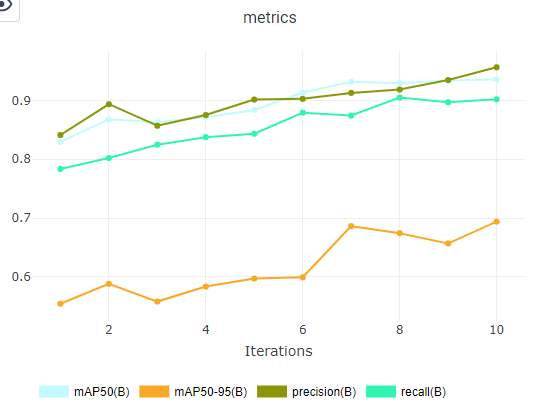
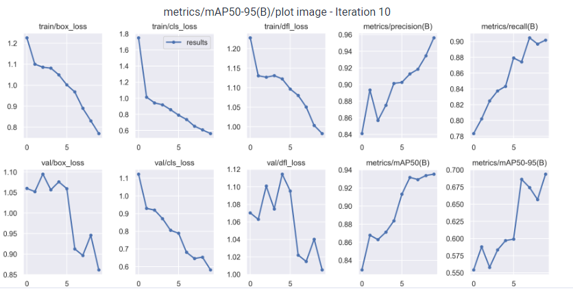
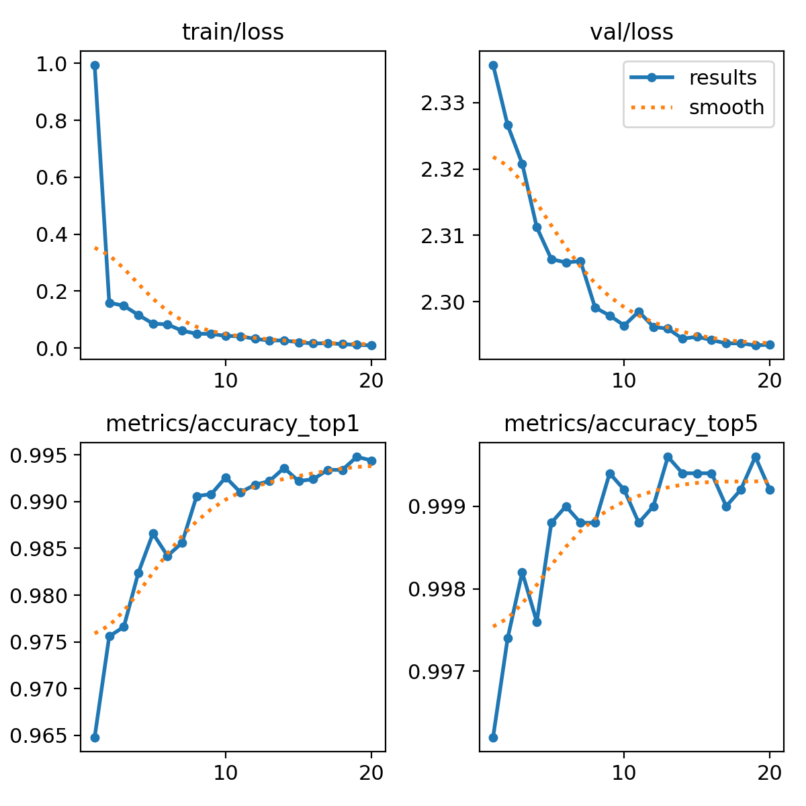
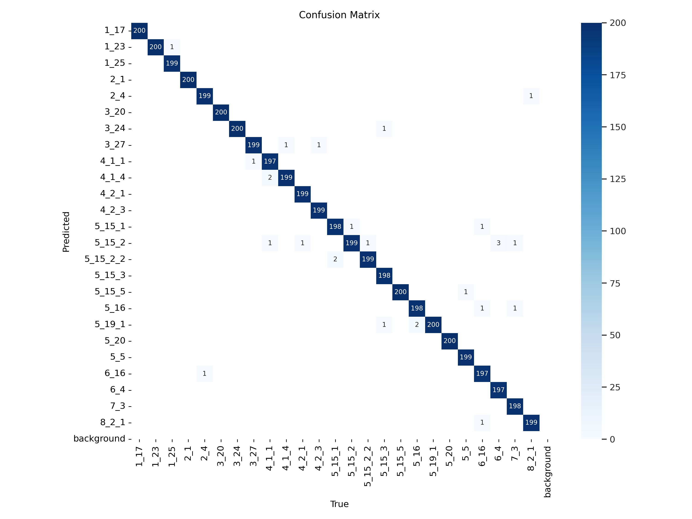

# Проект "Распознавание дорожных знаков"

Наш проект посвящён распознаванию и классификации дорожных знаков.

## Постановка бизнес-задачи

**Кому и как это может пригодиться?**

- водителю как расширение функциональности автомобиля: подаётся видео с камеры заднего/переднего вида или видеорегистратора; на выходе голосовая информация об обнаружении дорожных знаков и рекомендации по принятию решений (ADAS, Advanced Driver Assistance Systems);
- расширение функциональности навигаторов и карт: наше решение нужно для ускорения работы картографов, которые наносят на карты информацию о дорожных знаках. На вход подаются кадры, заснятые видеорегистратором, нужно на них детектировать и классифицировать знаки;
- в системах мониторинга знаков на дорогах для служб дорожного хозяйства;
- в совокопнуости со множеством других технологий (датчики, сенсоры и тп) обученная модель может быть использована в беспилотных автомобилях или автомобилях с режимом автопилот.

## ML-решение

### Общий пайплайн

Мы рассматривали 2 возможных варианта пайплайна обработки:

1. Входной кадр → Детектор (многоклассовый на все типы дорожных знаков) → Найденные знаки с координатами bbox-а и меткой

2. Входной кадр → Детектор (только 1 класс: road sign) → Кропы с дорожными знаками → Классификатор → Найденные знаки с координатами bbox-а и меткой

Идея реализации второго варианта пайплайна состоит в том, чтобы перенести борьбу с проблемой несбалансированностью классов на этап классификатора, на уровне которого её легче решать.

В рамках наших экспериментов по обучению моделей были опробованы оба варианта пайплайна.

### Используемый датасет

Для обучения, валидации и тестирования моделей мы использовали датасет с российскими дорожными знаками RTSD:

- [kaggle](https://www.kaggle.com/datasets/watchman/rtsd-dataset),
- [статья](https://computeroptics.ru/eng/KO/PDF/KO41-ENG%20-17/400221.pdf).

После проведённого нами анализа данного датасета ([eda](https://github.com/Shchetinnikov/Data_Centric_AI_course/blob/main/hw_1/notebooks/eda.ipynb)) были выявлены следующие проблемы:

- есть много редких классов,
- наблюдается несбалансированность между разными классами.

Поэтому датасет, использующийся в экспериментах, был модифицирован относительно исходного: оставлены только те классы, где количество меток больше или равно 500. После чего на каждый такой класс случайным образом выбирается 500 изображений, содержащих хотя бы одну метку. Итого имеется 36 сбалансированных классов и 16596 изображений.

Модифицированный датасет был выложен на kaggle: [our_dataset](https://www.kaggle.com/datasets/4991145816988d062fe6bb2db9298c816cd9f63f60d325635ecb82da77c9e760).

### Экcперименты по обучению моделей

1. **Первый вариант пайплайна:** была обучена детекционная модель yolov8 на всех классах дорожных знаков.

2. **Второй вариант пайплайна:** были отдельно обучены детекционная модель yolov8 с одним классом road_sign и классификационная модель yolov8.
    
    2.1. **Детекция:** для детектирования дорожных знаков одним классом была обучена легковесная модель YOLOv8 nano, т.к. в комплексном решении необходимо добиться высокой скорости работы программы. Ввиду того, что все дорожные знаки для данной модели должны быть одним классом, то датасет был уменьшен до 6000 тренировочных  и 1000 валидационных изображений. Данное решение позволяет интегрировать модель не только в приложения с постобработкой, но и решения, работающие в реальном времени.

    

      

            
      

      

            
      

    

    
    2.2. **Классификация:** для обучения использовался модифицированный датасет, состоящий из 20тыс. тренировочных изображений и 5тыс. валидационных. Были обучены три версии модели yolov8 (small, medium, large) в течение 20 эпох.

    Таблица `Оценка работы моделей`

|    модель   |       датасет      | число параметров | время инференса |           целевая метрика            |
|-------------|--------------------|------------------|-----------------|--------------------------------------|
| YOLOv8s-cls | RTSD Dataset (2GB) |     5 112 761    | 0.5ms inference |          top1 = 0.995 top5 = 1       |
| YOLOv8m-cls | RTSD Dataset (2GB) |    15 804 361    | 0.9ms inference |          top1 = 0.994 top5 = 0.999   |
| YOLOv8l-cls | RTSD Dataset (2GB) |    36 231 769    | 1.3ms inference |          top1 = 0.994 top5 = 0.999   |

  

        
  

  

        
  

### Итоговый выбор модели и пайплайна

...

## Веб-сервис

Для демонстрации работы приложения был реализован веб-сервис на streamlit: [web-service](https://github.com/DL-teammm/web_service). Его можно запустить локально, загрузить тестовое видео и посмотреть, как работает на нём наше решение.

### Демо

Демо с работой веб-сервиса можно посмотреть здесь: [google-drive-folder](https://drive.google.com/drive/folders/12qrrSAiGH0Bxblr4LR2Aez3EQwq6EMQH?usp=sharing).
